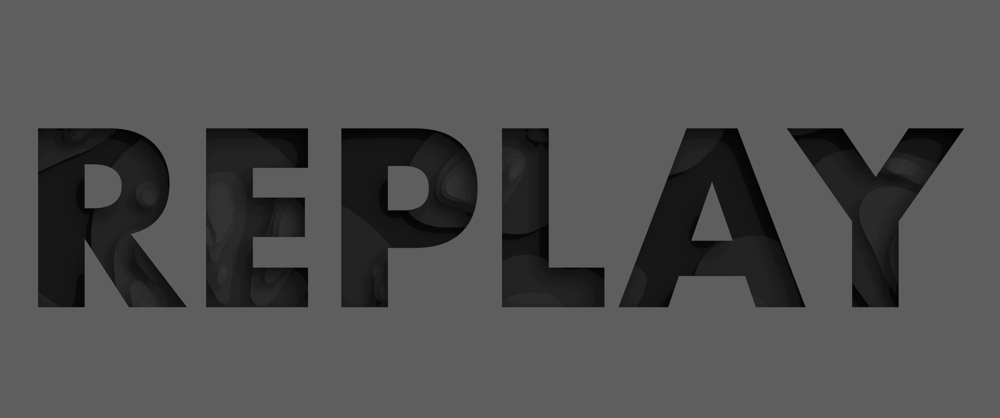

# Replay

This package implements data structures commonly used for text editing.

The piece table is the first such data structure, have a look at the piecetable package.

Example usage:

```go
import "github.com/oem/replay/piecetable"

pt := piecetable.New("an example string")
pt.Insert("unremarkable ", 3)
fmt.Println(pt, pt.Get())
```
